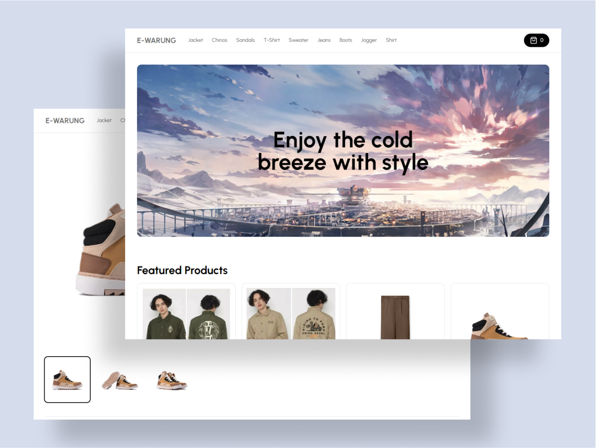

# E-Warung Client

E-Warung(Client) is an E-commerce app build with <b>Typescript, Next, & Tailwind<b>

## Overview

### Screenshot



### Links

- Repo URL: [Github](https://github.com/gfsxyz/warung-client)

- Live Site URL: [Live on Vercel](https://warung-client.vercel.app/)

### Built with

- [Typescript](https://www.typescriptlang.org/) - JS but cooler
- [Next JS](https://nextjs.org/) - JS Framework
- [Tailwind](https://tailwindcss.com/) - styles

## Author

- Website - [gustifaizal.com](https://gustifaizal.com/)
- Twitter - [@gfsxyz](https://twitter.com/gfsxyz)

## ⚒ Usage

### 👥 Clone the repo

```shell
$ git clone https://github.com/gfsxyz/warung-client.git
```

### 🔑 Setup Env File

Create an .env file on root file and insert:

```javascript
NEXT_PUBLIC_API_URL=https://warung-admin.vercel.app/api/55d3bf72-b32d-432e-9082-a96e86341a40
```

### 📦 Install dependencies

```shell
$ npm install
```

### ✨ Start/Run the app

```shell
$ npm run dev
```
